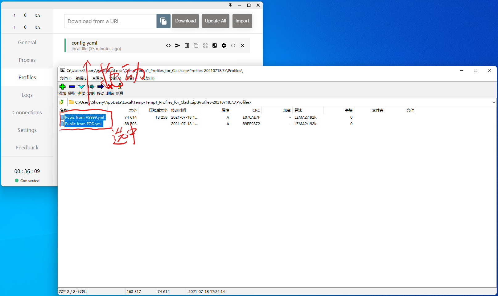
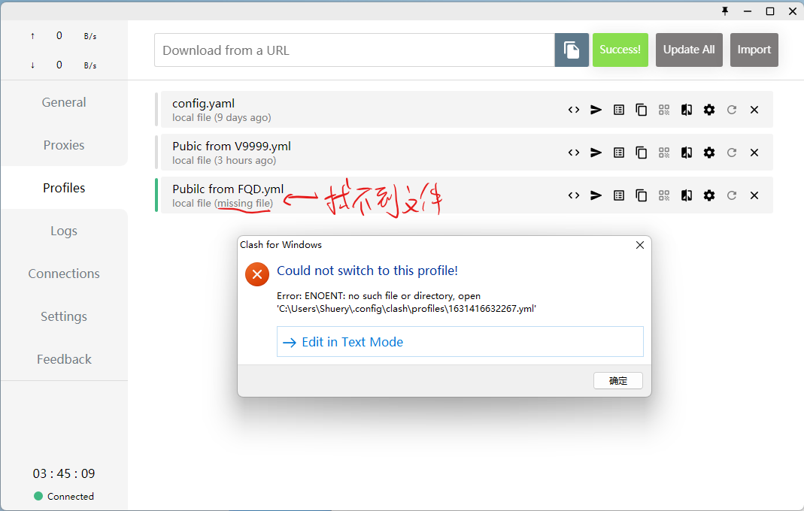
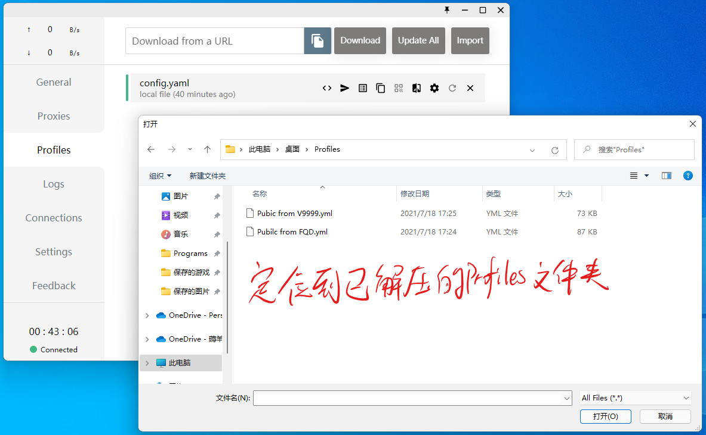
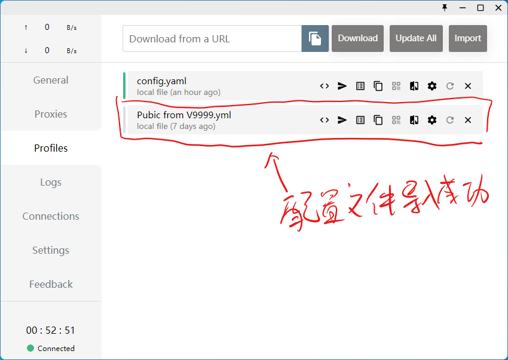

# [Profiles_for_Clash](https://github.com/Shuery-Shuai/Profiles_for_Clash "Shuery-Shuai/Profiles_for_Clash: Profiles can be used in Clash for Windows, Clash for Android and so on.")

一些可用于 Clash for Windows、Clash for Android 等应用的配置文件。

> **警告**：通过使用特殊方式访问外网时请**严格遵守当地法律法规**，**禁止借此进行传播“黄、赌、毒”等违法犯罪活动**。节点均来自网络收集，由网友免费提供，请**勿使用节点进行 BT 下载**。

## 导入方法

### [Clash_for_Windows](https://github.com/Fndroid/clash_for_windows_pkg "Fndroid/clash_for_windows_pkg: A Windows/macOS GUI based on Clash.") 本地导入

#### 拖拽导入

1. 直接将配置文件（无需解压）拖入 [Clash for Windows](https://github.com/Fndroid/clash_for_windows_pkg "Fndroid/clash_for_windows_pkg: A Windows/macOS GUI based on Clash.") **Profiles** 页面。

   

   > **注意**：直接拖拽导入可能会导致如下图所示的**找不到配置文件**的问题，如遇到此问题请**使用其他方法**导入配置文件。
   >
   > 

#### 通过\_Import\_按钮导入

1. 解压 **Profiles** 文件夹

   

2. 点击 **Import** 按钮

   

3. 定位 **Profiles** 文件夹

   

4. 选中配置文件并打开

   

   > **注意**：本操作**不支持多选**，如有多个文件需**重复 2 ~ 4 步**。

5. 导入成功

   

### [Clash_for_Windows](https://github.com/Fndroid/clash_for_windows_pkg "Fndroid/clash_for_windows_pkg: A Windows/macOS GUI based on Clash.") 网络导入

1. 复制配置链接

   

   > **提示**：本项目[配置文件链接](#配置文件链接 "点击前往“配置文件链接”")。

2. 粘贴配置链接并点击 **Download** 按钮下载

   

3. 导入成功

   

   > **注意**：网络导入成功后会**自动**将配置切换至**刚刚导入的配置**。

> **注意**：通过网络导入 [Github\_配置文件链接](#Github_配置文件链接 "点击前往“Github_配置文件链接”") 的配置文件需能够访问 _<https://raw.githubusercontent.com>_。
>
> **提示**：无法访问的可使用 [Gitee\_配置文件链接](#Gitee_配置文件链接 "点击前往“Gitee_配置文件链接”")。

## 配置文件及其来源

“Public from V9999”来自 [Alvin9999](https://github.com/Alvin9999 "Github@Alvin9999 (自由上网)") 在项目 [new-pac](https://github.com/Alvin9999/new-pac "Alvin9999/new-pac: 科学上网/自由上网/翻墙/软件/方法，一键翻墙浏览器，免费shadowsocks/ss/ssr/v2ray/goflyway账号/节点分享，vps一键搭建脚本/教程。") 中的分享。

“Public from FQD”来自 [翻墙党](https://fanqiangdang.com "翻墙论坛 | 翻墙党社区 -  Powered by Discuz!") 在群组 [SS 节点公益发放](https://t.me/ssList "Telegram@ssList")、[SSR 节点免费发放](https://t.me/ssrList "Telegram@ssrList")、[V2ray,Vmess 节点免费发放](https://t.me/V2List "Telegram@V2List")中的分享。

> **提示**：本项目所有配置均通过 [tiny2013](https://github.com/tindy2013 "Github@tindy2013 (Tindy X)") 开发的 [subconverter](https://github.com/tindy2013/subconverter "tindy2013/subconverter: Utility to convert between various subscription format.") 自动生成。
>
> **注意**：本项目配置均来自网络，若有侵权，请提出，会尽快删除。

## 建议添加规则

```yaml
rules:
  - DOMAIN,tencentcs.com,DIRECT # 腾讯云
  - DOMAIN,pufei.org,DIRECT # 扑飞漫画
  - DOMAIN-SUFFIX,res.img.jituoli.com,DIRECT # 扑飞漫画图床
  - DOMAIN,qyi.io,DIRECT # 浅忆博客
```

## 配置文件链接

### Github\_配置文件链接

- [Public from V9999](https://raw.githubusercontent.com/Shuery-Shuai/Profiles_for_Clash/main/Profiles/Public%20from%20V9999.yml "“Public from V9999”链接（“右击”后选择“复制链接”）")
- [Public from FQD](https://raw.githubusercontent.com/Shuery-Shuai/Profiles_for_Clash/main/Profiles/Public%20from%20FQD.yml "“Public from FQD”链接（“右击”后选择“复制链接”）")

### Gitee\_配置文件链接

- [Public from V9999](https://gitee.com/Shuery-Shuai/Profiles_for_Clash/raw/main/Profiles/Public%20from%20V9999.yml "“Public from V9999”链接（“右击”后选择“复制链接”）")
- [Public from FQD](https://gitee.com/Shuery-Shuai/Profiles_for_Clash/raw/main/Profiles/Public%20from%20FQD.yml "“Public from FQD”链接（“右击”后选择“复制链接”）")

> **注意**：Gitee 上的链接存在一定的**更新延迟**。

## 文档更新日志

- 2021/03/06 09:25:31
  1. 创建文件。
- 2021/03/21 10:58:32
  1. 新增“Public from FQD”介绍。
- 2021/04/20 20:38:13
  1. 添加网络导入 URL。
- 2021/04/20 21:13:35
  1. 修改导入方法；
  2. 添加配置文件生成工具来源；
  3. 更新配置文件 URL。
- 2021/07/25 11:53:08
  1. 改善文档排版；
  2. 增加 Clash for Windows 导入方法；
  3. 删除 Clash for Android 导入方法（不详细）。
- 2021/09/12 11:33:14
  1. 增加“建议添加规则”；
  2. 增加“直接拖拽导入”可能引发的问题。
- 2021/09/12 11:44:53
  1. 改善文档排版。
- 2021/09/24 12:51:43
  1. 增加配置文件链接地址：Gitee 上的链接。
- 2021/09/27 12:32:13
  1. 增加警告。
- 2021/10/16 08:22:46
  1. 更改标题空格为下划线以方便跳转；
  2. 更新配置文件链接。
